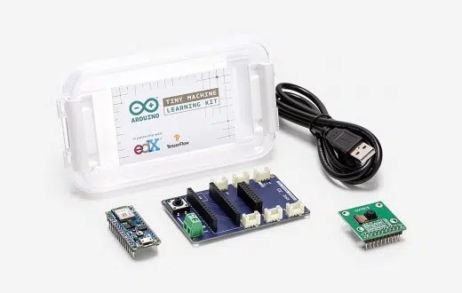
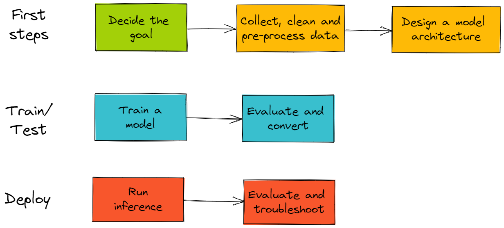
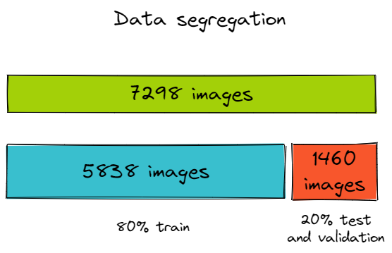
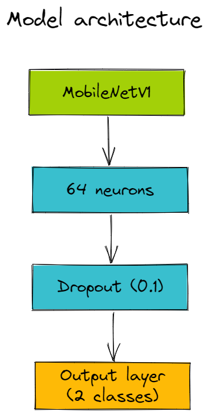
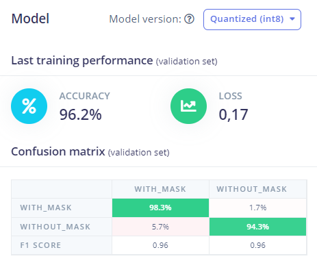
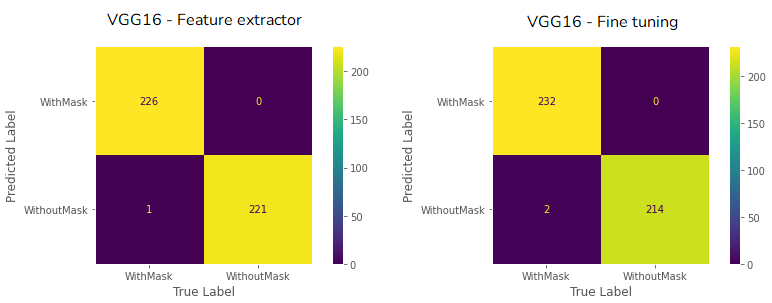
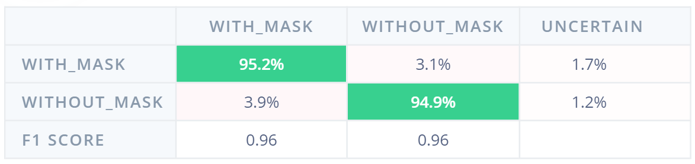

# TinyML Face Mask Detection

## Introduction

Many people have been using machine learning to create innovative solutions in all areas of science. Some models have up to 99% accuracy, and that's very cool, but in general, these models are hefty, and trained for hours or even days on powerful GPUs. The challenge we bring today is: how to run such a model on an embedded device? In general, these devices have limited processing and memory, and should not have high power consumption.

With that in mind, [Mariana Azevedo](https://github.com/marianabritoazevedo), [Morsinaldo Medeiros](https://github.com/morsinaldo) and I did a small project to embed a model that detects whether or not a person is wearing a mask from a photo into an Arduino Nano 33 BLE Sense provided by [Edge Impulse](https://edgeimpulse.com), which can be seen in the image below.

<p align='center'>
    
    
Source: [Embarcados (2020)](https://embarcados.com.br/tinyml-machine-learning-para-microcontroladores/)
</p>

Furthermore, for comparison purposes, we performed the process of transfer learning with the GPU of Google Colaboratory using three different architectures: VGG-16, DenseNet, and MobileNet.

## The Big Picture

Overall, our project was divided into three steps: The first steps; Train/Test and Deploy. The block diagram below shows the steps of our project. Initially, the first steps and the train/test stage were made on Google Colaboratory to compare three different transfer learning architectures, in order to analyze which one is the best to put in our final model. Then, the whole process was made on the Edge Impulse platform, deploying the final model on our Arduino Nano 33 board.

<p align='center'>
    
</p>

### First Steps

**The Goal**: Our project aims to create a classifier model that, given an image, indicates whether or not a person is wearing a mask.

**Collect, clean and pre-process the data**: The dataset can be found on [Kaggle](https://www.kaggle.com/datasets/ashishjangra27/face-mask-12k-images-dataset) and has 12000 images, but only 7298 images were collected. Thus, the data were divided into 80% for training (5838 images) and 20% for testing (1460 images). Some examples can be seen below. The choice of theme is due to the context of the Covid-19 pandemic still being experienced today. 

<p align='center'>
    
</p>

**Design a model architecture**: The model was built from Edge Impulse's platform and it was chosen to use transfer learning from the MobileNetV1 model through EON Tuner tool. The architecture of the model can be seen below:

<p align='center'>
    
</p>

## Train/Test

**Train a model**: The training was performed for 20 epochs and the hyperparameter tuning was done using a tool called EON Tuner, which searches for parameters for the model architecture according to some targets defined by the group. The result of the chosen model and the target can be seen in the images below.

<p align='center'>
  
</p>

<p align='center'>
    
</p>

With this, it is possible to observe that all parameters were within the limitations of the device we want to ship the model and a very good acuity was obtained. It is important to point out that it is good practice that the model occupies about 50% of the total available RAM, since it will be necessary to load the image that will be made the inference during the use of the device.


**Evaluate and Convert**: Once the model is trained, it is time to feed it data that it missed during training. The result of this step can be seen in the step below:

<p align='center'>
    
</p>

Finally, the platform already provides an option to convert the template to the format that the target device will run on.

### Deploy

Once you have downloaded the model, you use the Arduino IDE to load it into the device. As shown in the diagram below, you first add the [.zip](./library_zip/) file of the model as a library and then perform the inference using the BLE 33 camera itself.

The step-by-step on how to deploy can be found in more detail in Marcelo Rovai's course [](https://github.com/Mjrovai/UNIFEI-IESTI01-TinyML-2022.1).

## Results

In the following figure, it is possible to observe the confusion matrix of the best model trained on Google Colab, which shows that the models predicted the wrong label in very few cases. 

<p align='center'>
    
</p>

The following figure shows the confusion matrix of the Edge Impulse with the quantized model, in which it is possible to see that the employed model had a high hit rate, getting the uncertain result in only a small number of cases.

<p align='center'>
    
</p>

Even though the model got the label wrong more times than those trained on Colab, the model trained by Edge Impulse obtained excellent results, given the process of quantization made to meet the Arduino BLE constraints.

## How to run

It is important to know that these steps on how to run take into account that the whole process of creating the model has already been done in the [Edge Impulse] platform (https://www.edgeimpulse.com/). In addition, the MLOps [Weights & Biases (Wandb)](https://wandb.ai/site) platform was used to send the data and the results of the transfer learning process performed on Google Colaboratory.

Clone this repository 

```
git clone https://github.com/thaisaraujo2000/facemask.git
```

### Part I - Running on Google Colaboratory

1. Create an account on Wandb

2. Put all notebooks on Google Colaboratory

3. In each code, put your Wandb username
```
run = wandb.init(entity="username",project=args["project_name"], job_type="fetch_data")
```
4. Run the notebooks according to the numbering order established in the name of each one

### Part II - Embedding the model 

1. Download Arduino IDE, you can check it [here](https://www.arduino.cc/en/software)

2. Install the libraries necessary to run this project. They are: `Arduino Mbed OS Nano Boards`, `Harvard_TinyMLx`, `Arduino_TensorFlowLite` and `Arduino_OV767X`.
To install the libraries, you can follow these steps:

```
Tools >> Manage libraries
```

:heavy_exclamation_mark: Attention: to install `Arduino_TensorFlowLite`, it is necessary to use this [repository](https://github.com/tensorflow/tflite-micro-arduino-examples)

3. Take the file `ei-face_mask_detection_2-arduino-1.0.5.zip` in the folder `library_zip` and add as a library in Arduino IDE. This can be done by following the sequence:

```
Sketch >> Include library >> Add .zip library
```

4. Choose the file with the project
```
File >> Examples >> face_mask_detection_2_inferencing >> nano_ble33_sense >> nano_ble33_sense_camera
```

5. Connect your Arduino Nano 33 BLE sense with the Arduino IDE. 
```
Tools >> Board >> Arduino Mbed OS Nano Boads >> Arduino Nano 22 BLE
```

6. Connect the port
```
Tools >> Port >> COM4 (this may change)
```

7. Run the project
```
Verify >> Upload
```

## References

- [Edge Impulse](https://www.edgeimpulse.com)

- [Weights & Biases](https://wandb.ai/site)

- [Ivanovitch's repository](https://github.com/ivanovitchm/embedded.ai)

- [Kaggle | Face mask Dataset](https://www.kaggle.com/datasets/ashishjangra27/face-mask-12k-images-dataset)

- [Marcelo Rovai's course](https://github.com/Mjrovai/UNIFEI-IESTI01-TinyML-2022.1)
